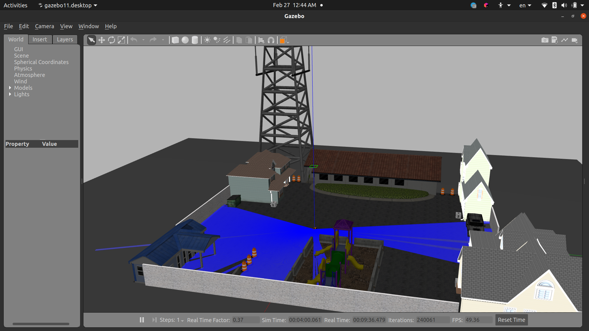
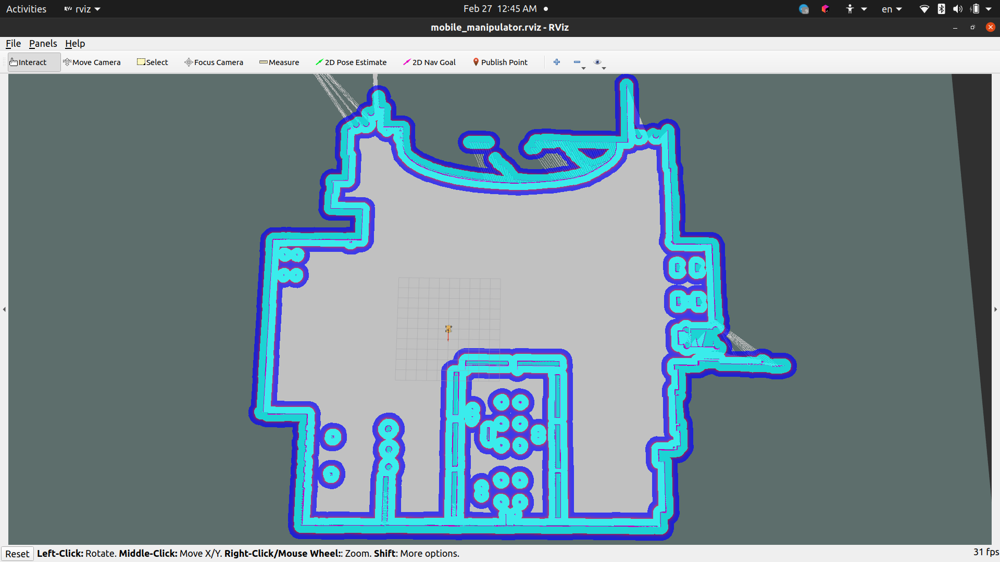
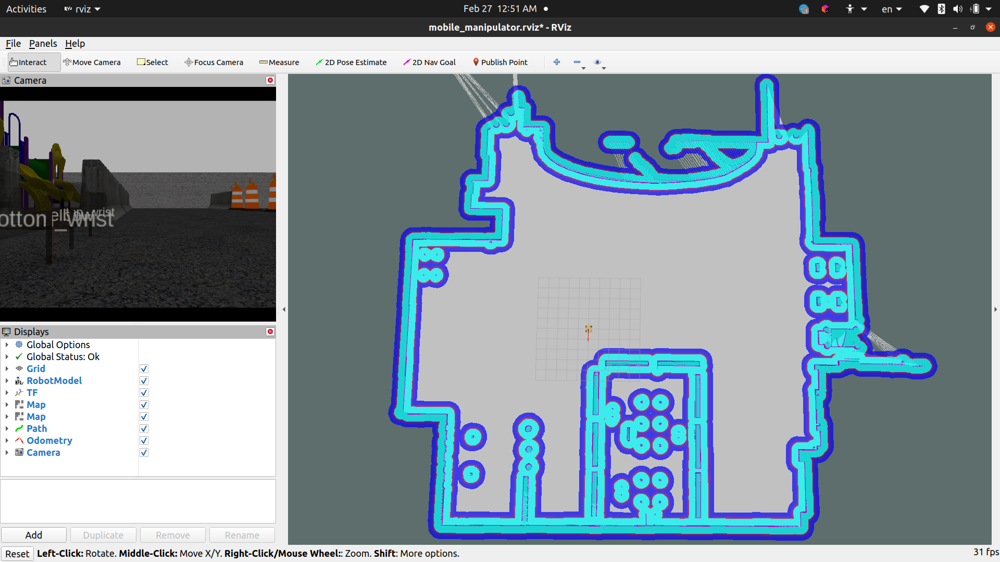

# YOUR_REPO_NAME

## Project Description

This repository contains the RDF descriptions of a mobile robot equipped with a manipulator arm. The robot features a suite of navigation and localization algorithms including:

- **Localization**: Adaptive Monte Carlo Localization (amcl)
- **Mapping**: An algorithm for generating maps of the environment
- **Autonomous Navigation**: `move_base` for autonomous following to given points
- **Sensors**: Equipped with a camera and ultrasonic sensors for perception

This setup is designed for research and development in robotics, offering a comprehensive platform for testing and deploying robotic applications.

## Installation

To use this project, you need to have ROS (Robot Operating System) installed on your system, along with a catkin workspace set up. Follow these steps to get started:

1. Navigate to your catkin workspace:
    ```bash
    cd ~/catkin_ws/
    ```
2. Build the project using `catkin_make`:
    ```bash
    catkin_make
    ```

    This will compile all the necessary ROS packages and nodes for the project.

## Running the Project

To launch the simulation and start the robot, use the following commands:

1. Launch the robot in Gazebo:
    ```bash
    roslaunch mobile_robot gazebo.launch
    ```
2. In a new terminal, launch the `move_base` node for autonomous navigation:
    ```bash
    roslaunch mobile_robot move_base.launch
    ```
3. To send goals to the robot, use:
    ```bash
    rosrun mobile_robot send_goals
    ```

## Visualization

### Robot in Gazebo



This image shows the robot in the Gazebo simulation environment, where you can test the robot's physical properties and interactions with the world.

### Robot in RViz



Additional RViz View:



Here, the robot is visualized in RViz, allowing for detailed observation of sensor data, navigation paths, and the overall state of the robot in a simulated environment.


---

We hope this project serves as a valuable tool for your robotics research and development. Happy coding!
